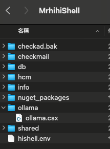
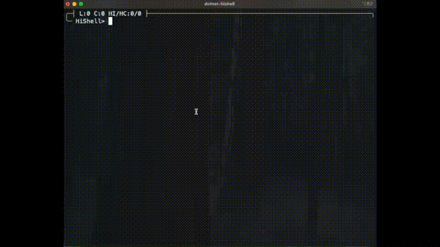

# HiShell

HiShell is a simple shell simulator that supports a basic text editor for inputting commands.
[](https://deepwiki.com/mrhihi/MrHihi.HiShell)

## Usage

### Installations

```shell
dotnet tool install --global MrHihi.HiShell
```

### Create a new Environment

```shell
dotnet hishell new zsh ~/hishell
# or
dotnet-hishell new zsh ~/hishell

```

This will create a new environment in the ~/hishell directory  
In the ~/hishell directory, you will find the following file  
`hishell.env`  

You can edit the `hishell.env` file to customize the environment.  

### Run the Environment

```shell
dotnet hishell run ~/hishell
# or
dotnet-hishell run ~/hishell
```

or

```shell
source ~/hishell/hishell.env
```

### Create csx file

In the `~/hishell` directory, you can create a directory named `COMMAND YOU WANT` and create a `csx` file with the same name as the directory in it.

And you will be able to run the `csx` file by typing `!` followed by the directory name in the shell.

## csx environment



### Ollama Sample



### ollama.csx

```csharp
#r "nuget:OllamaSharp, 5.1.4"
#r "nuget:Microsoft.Extensions.AI.Abstractions, 9.3.0-preview.1.25114.11"

using System;
using System.Threading.Tasks;
using System.Net.Http;
using OllamaSharp;

await ollama(GetCommandlineArgs(), GetBuffer());

public async Task ollama(string[] args, string buffer)
{
    var URI = new Uri(Environment.GetEnvironmentVariable("OLLAMA_URL") ?? "http://127.0.0.1:11434");
    var MODEL_ID = Environment.GetEnvironmentVariable("OLLAMA_MODEL_ID") ?? "llama3.1";

    if (buffer == "")
    {
        Console.WriteLine("Please input some text.");
        return;
    }
    var ollama = new OllamaApiClient(URI);
    ollama.SelectedModel = MODEL_ID;
    var chat = new Chat(ollama);
    await foreach (var answerToken in chat.SendAsync(buffer))
    {
        Console.Write(answerToken);
    }
}
```
